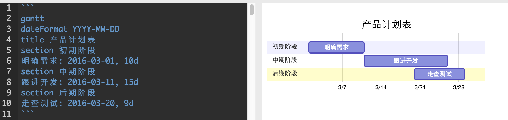
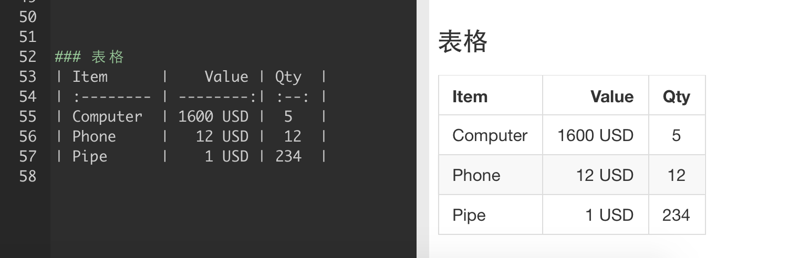

# Markdown笔记

Markdown笔记什么是Markdown？Markdown是一种轻量级的「标记语言」，通常为程序员群体所用，目前它已是全球最大的技术分享网站 GitHub 和技术问答网站 StackOverFlow 的御用书写格式。

有道云笔记内置Markdown编辑器和使用指南，非技术类笔记用户，千万不要被「标记」、「语言」吓到，Markdown的语法十分简单，常用的标记符号不超过十个，用于日常写作记录绰绰有余，不到半小时就能完全掌握。就是这十个不到的标记符号，却能让人优雅地沉浸式记录，专注内容而不是纠结排版，达到「心中无尘，码字入神」的境界。

### 一、利用Markdown可以做什么？

① 代码高亮

② 制作待办事项To-do List

③ 高效绘制 流程图、序列图、甘特图、表格流程图：

流程图

序列图

甘特图

表格

#### ④ 书写数学公式

