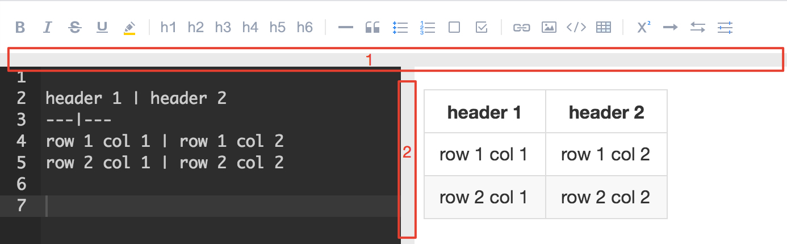
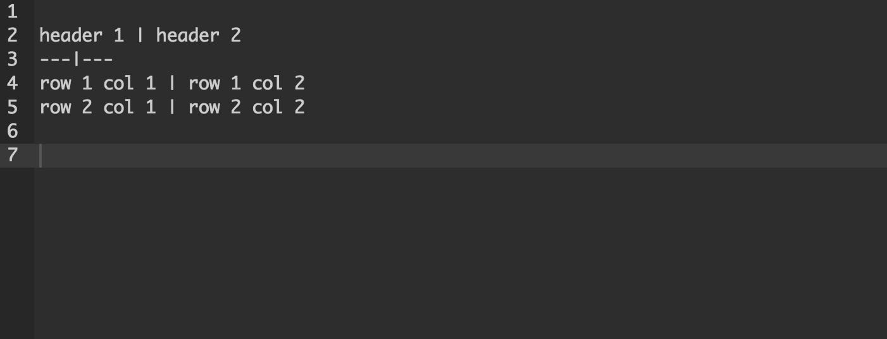

# Tips for 有道云笔记中的 Markdown

### ① 实时同步预览，所看即所得

我们将笔记编辑界面一分为二，左边为编辑区，右边为预览区，两区滚动条同步。在编辑区的操作能够实时反映在预览区，方便及时调整和查看最终版面效果。

### ② 工具栏内置Markdown语法，方便新手学习

编辑页面顶端的工具栏有对应代码，如果你是一个不熟悉Markdown语法的新手，可以先尝试用工具栏辅助操作。也可以在网上搜索「Markdown语法指南」进行学习。

当然，如果你觉得工具栏太打扰，点击下方分界条即可隐藏工具栏，切换到极简编辑环境。

### ③ 实时云端保存

Markdown模式继承了有道云笔记的优良传统，你每一次击键的内容都会实时保存在云端，无需担心浏览器崩溃、设备没电、突然断网等情况。对于写作者来说，更是再也不用担心因为各种原因痛失文稿的情况了。

### ④ 界面大小可点击分界条调整

点击“1”处，工具栏收起；

点击“2”处，右侧预览区收起。

点击后效果如图

