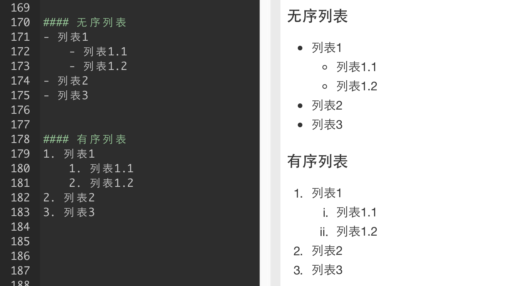
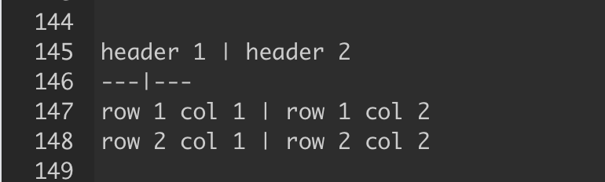
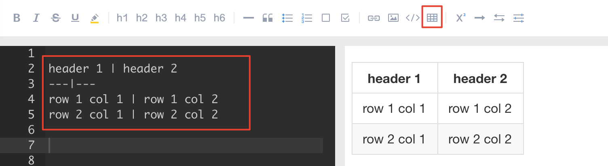

# 【简明版】有道云笔记Markdown指南

### 0 标题

标题是每篇文章必备而且最常用的格式。

在Markdown中，如果想将一段文字定义为标题，只需要在这段文字前面加上 \#，再在 \# 后加一个空格即可。还可增加二、三、四、五、六级标题，总共六级，只需要增加 \# ，增加一个 \# ，标题字号相应降低一级。如图

### 1 列表

列表格式也很常用，它可以让你的文稿变得井井有条。在 Markdown 中，你只需要在文字前面加上 - 就可以了；如果你希望是有序列表，在文字前面加上 1. 2. 3. 即可。  
_注：-、1.和文字之间要保留一个字符的空格。_

### 2 引用

如果你需要在文稿中引用一段别处的句子，那么就要用到「引用」格式。

在引用文字前加上 &gt; 并与文字保留一个字符的空格，即可

### 3 粗体和斜体

Markdown 的粗体和斜体也非常简单：

用两个 \* 包含一段文本就是粗体的语法；

用一个 \* 包含一段文本就是斜体的语法

### 4 链接与图片

链接：在 Markdown 中，插入链接只需要使用 \[显示文本\]\(链接地址\) 即可。

图片：在 Markdown 中，插入图片只需要使用 !\[显示文本\]\(图片链接地址\)即可。

_注：插入图片的语法和链接的语法很像，只是前面多了一个 ！_

### 5 分割线

分割线的语法只需要另起一行，连续输入三个星号 \*\*\* 即可分割两段文字内容。

如图

### 6 表格

当你需要在Markdown文稿中键入表格，代码如下

**如上7大格式是写作文稿时最常使用的。**

怎么样，看了相关Markdown语法是不是觉得挺简单？

当然，Markdown新手在使用不熟练的情况下，可能会忘记相关语法，也没关系，笔记的工具栏内置了Markdown语法，方便学习与熟悉。

如，「表格」语法相对复杂，你可能忘记了，这时候，你只需要点击编辑框上方工具栏，点选「表格」的图标，左边编辑区便会出现「表格」相应代码

然后，你只需要将代码替换成相应文本即可，如图

熟悉语法之后，还是建议大家少使用辅助工具栏，尽量自己键入代码，感受纯文本之美。

当然，有道云笔记的Markdown还能支持制作待办事项，书写流程图、序列图、甘特图，书写数学公式等，是不是够极客，够有逼格？

看看笔记菌用Markdown甘特图写的项目计划时间表：

