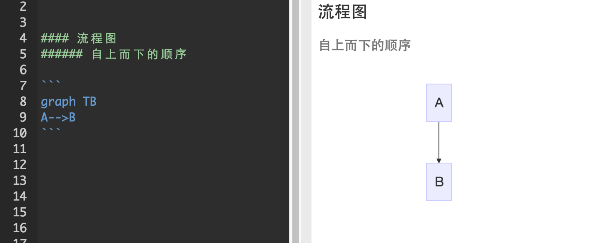
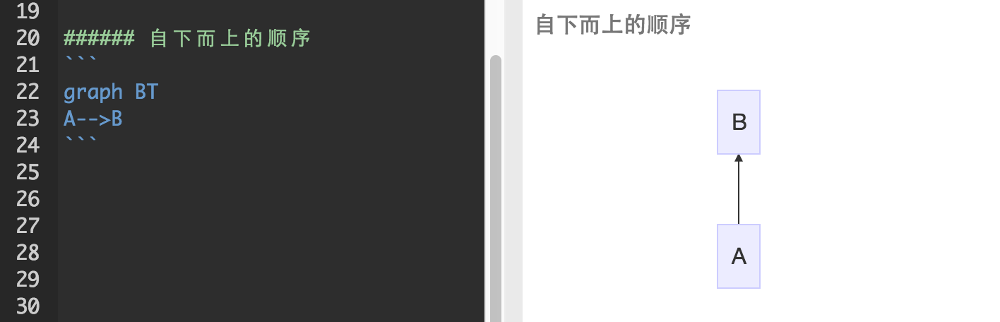
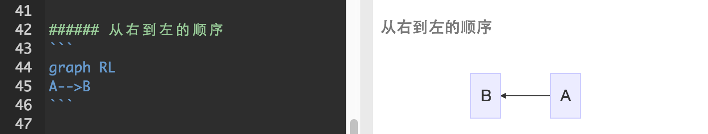
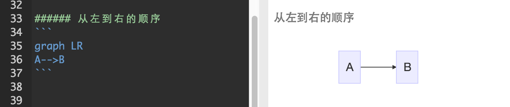
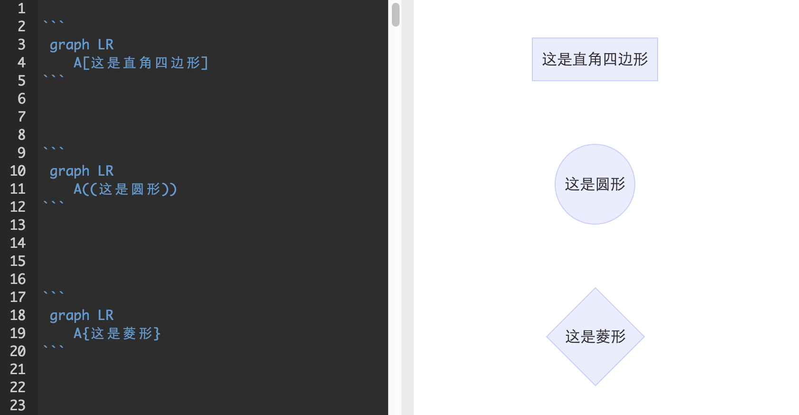
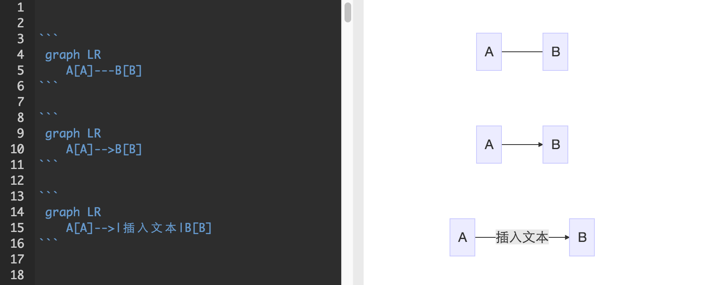
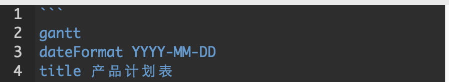

# 【进阶版】有道云笔记Markdown指南

**有道云笔记内置Markdown编辑器和使用指南。**

“进阶版”有道云笔记Markdown指南，教你如何进一步掌握待办、清单、流程图和甘特图。

### 0 待办和清单

待办事项和清单在日常工作、生活中经常被使用。

在Markdown中，你只需要在待办的事项文本或者清单文本前加上- \[ \]、- \[x\]即可。

- \[ \] 表示未完成，- \[x\] 表示已完成。

_注：键入字符与字符之间都要保留一个字符的空格。_

具体呈现如下

### 1 流程图

在Markdown中，一段流程图语法以 “\` 开头，以 “\` 结尾。

在 “\` 后另起一行，书写graph XX，用以确定将要绘制的流程图及其类型（XX表示流程图类型）。

流程图分为竖向和横向两大类，竖向包括自上而下和自下而上两种顺序，横向包括从右到左和从左到右两种顺序。

其对应语法分别为：graph TB/graph BT/graph RL/graph LR。

* TB - top bottom（自上而下）
* BT - bottom top（自下而上）
* RL - right left（从右到左）
* LR - left right（从左到右）

简单示例如图

来学习一个具体案例

仔细研究上述案例，会发现我们可以通过调整语法来调整流程图的框线、连接线，不同条件能导向不同结果。

#### ①对框线形状的调整，如

#### ②对箭头的调整，如

只要充分掌握该语法，再复杂的流程图也完全能用Markdown书写！

更详细的流程图语法，可参见：[https://github.com/mermaid-js/mermaid](https://github.com/mermaid-js/mermaid)

### 2 甘特图

我们在工作中用甘特图作计划进度表、项目进度表再合适不过了。

以如下甘特图为例说明

与流程图一样，Markdown中，甘特图的语法也是以 “\` 开头，以 “\` 结尾。

在 “\` 后另起一行，书写 gantt ，用以确定将要绘制的是甘特图。

标题的书写语法如下

_dateFormat YYYY-MM-DD规定了时间轴，title （标题文本）表示甘特图标题。_

如需按项目进行划分，需键入section，空一个字符，再输入项目名称的文本（一个section和另一个section之间要空行）。

每个大项目将拆解为若干个小任务，只需在section之后另起一行，直接输入小项目名称即可。

